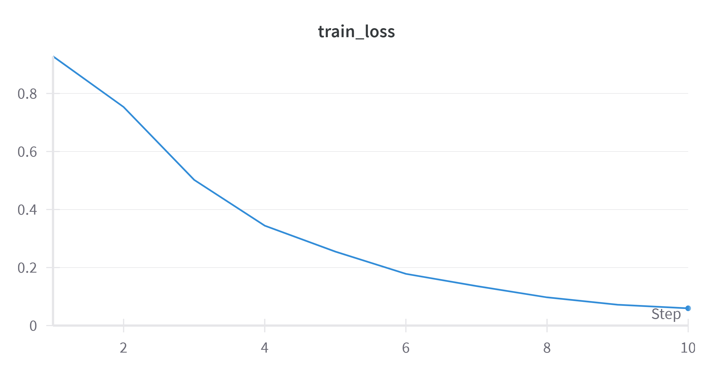
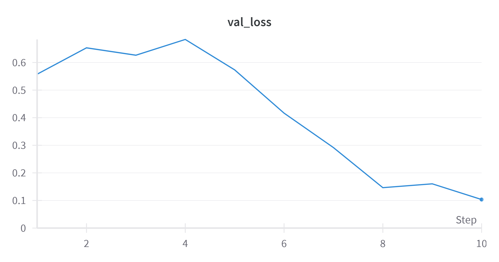

# Deep Fake Audio Detection

> Alli Khadga Jyoth - M23CSA003

Github Link: [Audio-Deepfake-Detection](https://github.com/KhadgaA/Audio-Deepfake-Detection)

Gradio Link: [AudioDFD](https://huggingface.co/spaces/KhadgaA/AudioDFD)

Wandb Run: [Finetuning logs](https://wandb.ai/khadgaa/SSL_Anti-spoofing/runs/clg0gq93?nw=nwuserkhadgaa)

## Task 1&2: Evaluate model on Custom Dataset

* To evaluate the DF model on the custom dataset, please go to `SSL_Anti-spoofing` folder. Then run `Evaluate_Speech_A3.py` file with arguments `--data_dir` set to dataset path.
* Dataset folder structure:

  > Dataset
  > | __ Real
  > | __ Fake
  >
* Equal Error Rate (EER): 30.69%
* Area Under the Curve (AUC): 0.2387

## Task 3: Model testing on for-2seconds dataset

Follow same process as in task 1. Change the `--data_dir` to the testing set of **`for-2seconds`** dataset.

* Dataset folder structure:

  > Dataset
  > | __ real
  > | __ fake
  >
* Total samples : 1088
* Equal Error Rate (EER): 33.27%
* Area Under the Curve (AUC): 0.2456

## Task 4: Finetuning on For-2seconds dataset

For finetuning the model on dataset, run the script `Finetune_Speech_A3.py` and change the `--data_dir_valid`  and `--data_dir_test` arguments to the respective train and validation directories. The finetuned models are saved in the finetuned_models folder.

For the assignment the model was finetuned for 10 epochs with lr = 0.000001 using the adam optimizer. The loss function used was Crossentropy. The wandb logs are given at [link](https://wandb.ai/khadgaa/SSL_Anti-spoofing/runs/clg0gq93?nw=nwuserkhadgaa).
The final train loss was **0.059** and the validation loss was **0.103**.

### Evaluating on Test set

Evaluating the finetuned model on the test set of the for-2seconds dataset we get the following results.

* Equal Error Rate (EER): 11.76%
* Area Under the Curve (AUC): 0.0437

## Task 5: Evaluating Finetuned model on Custom Dataset.

Evaluating finetuned model on Custom Dataset is same as Task1. Change the `--data_dir` to the test directory and `--model_path` to the finetuned model checkpoint path in finetuned_models directory.

The metrics after finetuning

* Equal Error Rate (EER): 47.36%
* Area Under the Curve (AUC): 0.4322

## Task 6: Results and Discussion

The model was evaluated on two datasets: a custom dataset and the for-2seconds dataset, both before and after fine-tuning. 

### Evaluation on Custom Dataset (Before Fine-tuning)

When evaluated on the custom dataset before fine-tuning, the model achieved the following metrics:

* Equal Error Rate (EER): 30.69%
* Area Under the Curve (AUC): 0.2387

These results indicate that the pre-trained model's performance on the custom dataset was relatively poor, with a high EER and a low AUC score. This could be due to the domain mismatch between the pre-training data and the custom dataset, or the presence of challenging samples in the custom dataset.

### Evaluation on for-2seconds Dataset (Before Fine-tuning)

Before fine-tuning, the model was evaluated on the testing set of the for-2seconds dataset, which consisted of 1088 samples. The results were:

* Equal Error Rate (EER): 33.27%
* Area Under the Curve (AUC): 0.2456

Similar to the custom dataset, the pre-trained model's performance on the for-2seconds dataset was suboptimal, with a high EER and a low AUC score.

### Fine-tuning on for-2seconds Dataset

To improve the model's performance, it was fine-tuned on the for-2seconds dataset for 10 epochs using an Adam optimizer with a learning rate of 0.000001 and a cross-entropy loss function. The final train loss was 0.059, and the validation loss was 0.103.

### Evaluation on for-2seconds Dataset (After Fine-tuning)

After fine-tuning, the model was evaluated on the testing set of the for-2seconds dataset, and the results were significantly better:

* Equal Error Rate (EER): 11.76%
* Area Under the Curve (AUC): 0.0437

The fine-tuning process significantly improved the model's performance on the for-2seconds dataset, as evidenced by the lower EER and higher AUC score compared to the pre-trained model's performance.

### Evaluation on Custom Dataset (After Fine-tuning)

The fine-tuned model was also evaluated on the custom dataset, and the results were:

* Equal Error Rate (EER): 47.36%
* Area Under the Curve (AUC): 0.4322

While the fine-tuned model's performance on the custom dataset improved compared to the pre-trained model, the results were still relatively poor. This could be due to the domain mismatch between the fine-tuning dataset (for-2seconds) and the custom dataset, or the presence of challenging samples in the custom dataset.

### Discussion

The results demonstrate the importance of fine-tuning the model on a relevant dataset to improve its performance. The fine-tuning process significantly improved the model's performance on the for-2seconds dataset, which was used for fine-tuning. However, the improvement in performance on the custom dataset was not as substantial, potentially due to domain mismatch or the presence of challenging samples.

One potential solution to improve the model's performance on the custom dataset could be to fine-tune the model on a combination of the for-2seconds dataset and the custom dataset, or to employ techniques such as data augmentation or transfer learning to bridge the domain gap.
