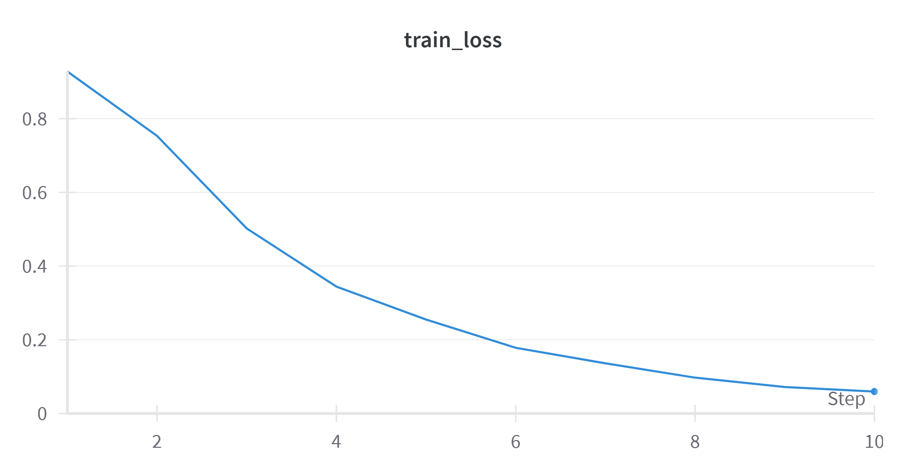
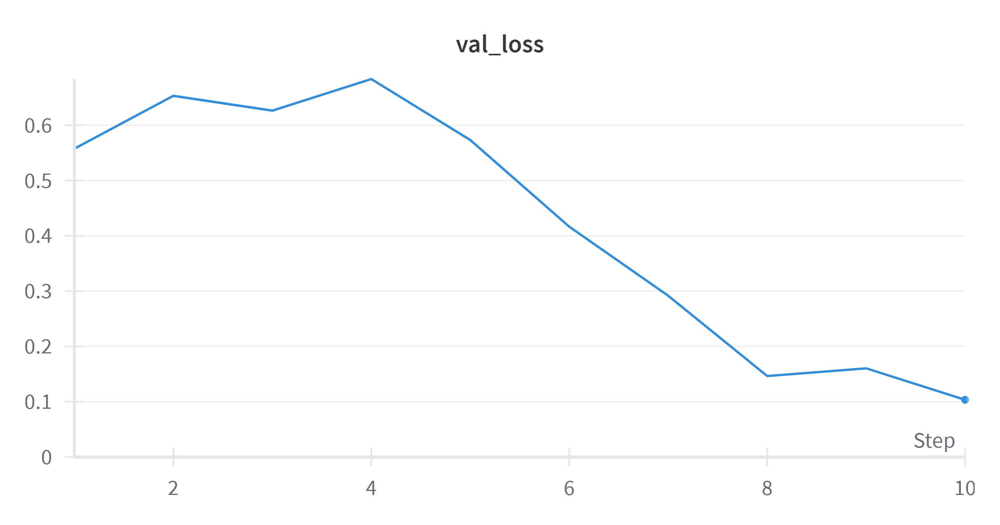

# Deep Fake Audio Detection

## Task 1&2: Evaluate model on Custom Dataset

* To evaluate the DF model on the custom dataset, please go to `SSL_Anti-spoofing` folder. Then run `Evaluate_Speech_A3.py` file with arguments `--data_dir` set to dataset path.
* Dataset folder structure:

  > Dataset
  > | __ Real
  > | __ Fake
  >

  **EER Score:** 30.69
  **AUC Score:** 0.2387

## Task 3: Model testing on for-2seconds dataset

Follow same process as in task 1. Change the `--data_dir` to the testing set of **`for-2seconds`** dataset.

* Dataset folder structure:

  > Dataset
  > | __ real
  > | __ fake
  >
* Total samples : 1088

**EER Score:** 33.27
**AUC Score:** 0.2456

## Task 4: Finetuning on For-2seconds dataset

For finetuning the model on dataset, run the script `Finetune_Speech_A3.py` and change the `--data_dir_valid`  and `--data_dir_test` arguments to the respective train and validation directories. The finetuned models are saved in the finetuned_models folder.

For the assignment the model was finetuned for 10 epochs with lr = 0.000001 using the adam optimizer. The loss function used was Crossentropy. The wandb logs are given at [link](https://wandb.ai/khadgaa/SSL_Anti-spoofing/runs/clg0gq93?nw=nwuserkhadgaa).
The final train loss was **0.059** and the validation loss was **0.103**.

## Task 5: Evaluating Finetuned model on Custom Dataset.

Evaluating finetuned model on Custom Dataset is same as Task1. Change the `--data_dir` to the test directory and `--model_path` to the finetuned model checkpoint path in finetuned_models directory.

The metrics after finetuning
**EER:** 11.76
**AUC:** 0.0437

## Task 6: Results and Discussion

1. **Custom Dataset**: The model performed poorly on the custom dataset before finetuning, with an EER (Equal Error Rate) of 30.69% and an AUC (Area Under the Receiver Operating Characteristic Curve) score of 0.2387. This indicates that the model struggled to distinguish between real and fake audio samples in this dataset.
2. **For-2seconds Dataset**: The model's performance on the for-2seconds dataset before finetuning was slightly worse than on the custom dataset, with an EER of 33.27% and an AUC score of 0.2456. This dataset might have been more challenging for the model due to the shorter audio clip duration (2 seconds).
3. **Finetuning**: After finetuning the model on the for-2seconds dataset for 10 epochs with a learning rate of 0.000001 using the Adam optimizer and cross-entropy loss, the model's performance improved significantly. The final train loss was 0.059, and the validation loss was 0.103, indicating that the model was able to learn the characteristics of the dataset effectively.
4. **Finetuned Model Performance on Custom Dataset**: When evaluating the finetuned model on the custom dataset, the EER improved to 11.76%, and the AUC score decreased to 0.0437. While the EER improvement is substantial, the low AUC score suggests that the model's ability to discriminate between real and fake audio samples is still limited.

The results highlight the importance of finetuning the model on a representative dataset to improve its performance. However, the relatively low AUC score on the custom dataset after finetuning suggests that there may still be room for improvement, possibly by exploring different model architectures, hyperparameter tuning, or incorporating additional features.
